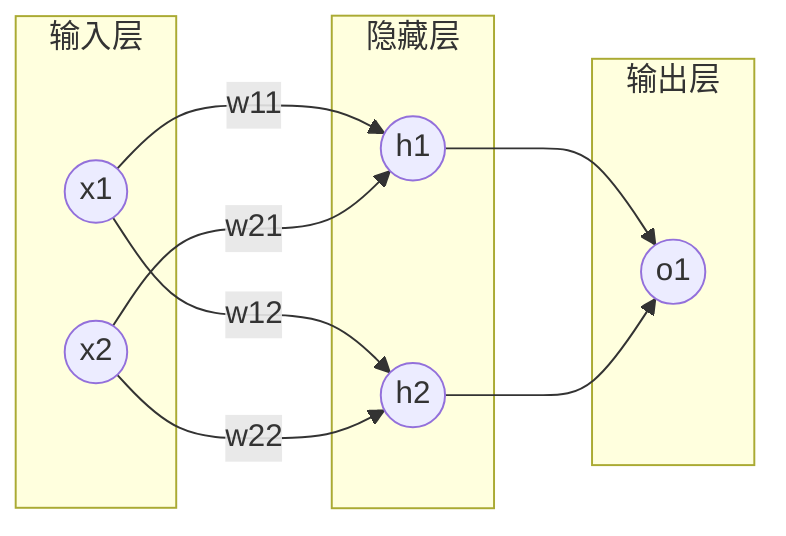

碎碎念：知识还没有完全还给老师 &#x1F604;
# 微分与梯度
## 微分
对于一元函数,描述了函数 $f$ 在 $x$ 处的变化率,直观表示为函数在该点的切线的斜率，为标量

$dy=f'(x)*dx$

多元函数的全微分:
$df=\frac{∂f}{∂x}*dx+\frac{∂f}{∂y}*dy+\frac{∂f}{∂z}*dz+...$
## 梯度
$▽f(x,y)=gradf(x,y)=( \frac{∂x}{∂f}, \frac{∂y}{∂f})$

梯度是一个向量，是多元函数在某一点处的偏导数构成的向量
在一元函数中，导数与梯度在`数值`上是相等的
## 自动微分/求导(autograd)
pytorch中，设置了require_grads=True 的tensor可以被计算梯度。在backward(反向传播)过程中会被autograd模块自动计算梯度并保存在 tensor.grad
## 梯度下降
沿着梯度向量的方向是函数增加的最快，更容易找到函数的极大值；
反之，沿着梯度向量相反的地方，梯度减少的最快，更容易找到极小值。

梯度下降，即每一点都沿着梯度方向的反方向求解，找到极小值(不一定是最小值)，反之为梯度上升。
> 类比: 从山上下山，想要最快地到达山底，每一步都考虑最优，则每一步都沿着最陡峭的地方下山，但很可能走不到山脚，因为可能会走到山峰局部的低谷。
# 神经网络
markdown画的图有点丑
在输入层(第一层)与输出层(最后一层)之间的都是隐藏层

## 前向传播(forward)
将上一层的输出作为下一层的输入，并计算下一层的输出，一直到运算到输出层为止。
$h_1=w_{11} *x_1+w_{21}*x_2$
$h_2=w_{12} *x_1+w_{22}*x_2$
变为矩阵的形式:
$H=W *X+B$
当然无论多少次线性运算最终的结果都会与原来是线性相关的，所以会使用激活函数使每一层的计算结果变为非线性，作为下一层计算的输入。
$z^{(l)}=W^{(l)} *a^{(l-1)}+b^{(l)}$
$a^{(l)}=σ(z)^{(l)}$
## 反向传播(backforward)
数学知识比较复杂，已经好多年没学数学了~只简述其原理
以下文章应该算是比较有价值的
https://zhuanlan.zhihu.com/p/32368246
https://zhuanlan.zhihu.com/p/71892752
### 链式法则
如果某个函数由复合函数表示，则该复合函数的导数可以用构成复合函数的各个函数的导数的乘积表示。

若$y=g(x)$,$z=f(g(x))=f(y)$,则

$\frac{dz}{dx}=\frac{dz}{dy}*\frac{dy}{dx}$

神经网络显然是复杂的复合函数，在计算梯度时遵循链式法则

### 损失函数
度量训练样本计算出的输出和真实的训练样本输出之间的损失。我们使用最常见的均方误差（MSE）来作为损失函数，
$C(W,b)=\frac{1}{2}||a^{(l)}-y||^2_2$
其中为训练样本计算出的输出，y为训练样本的真实值。加入系数 是为了抵消微分出来的指数。

### 反向传播算法
$z^{(l)}=W^{(l)} *a^{(l-1)}+b^{(l)}$
$a^{(l)}=σ(z)^{(l)}$
感兴趣的可以看：https://zhuanlan.zhihu.com/p/71892752

总之：
1. 初始化权重w与偏置b，
2. 通过前向传播算法计算输出，
3. 通过损失函数计算输出层的梯度
4. 使用反向传播算法计算
5. 通过梯度下降算法更新权重w与偏置b
6. 当所有的w与b的变化值都小于迭代阈值时结束循环
7. 输出各隐藏层与输出层的线性关系系数矩阵W和偏置b，得到确定的模型

